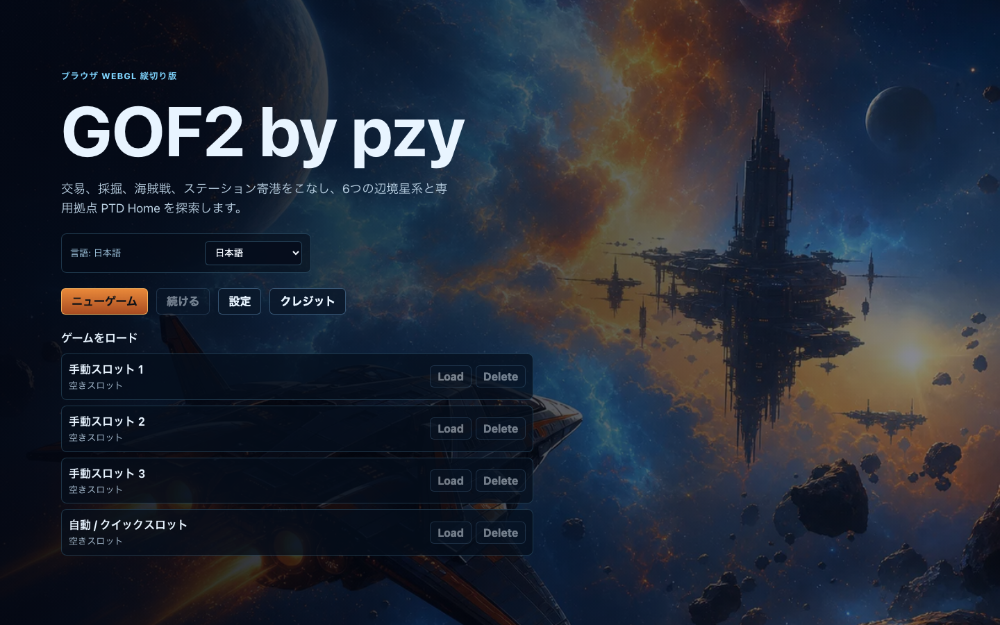
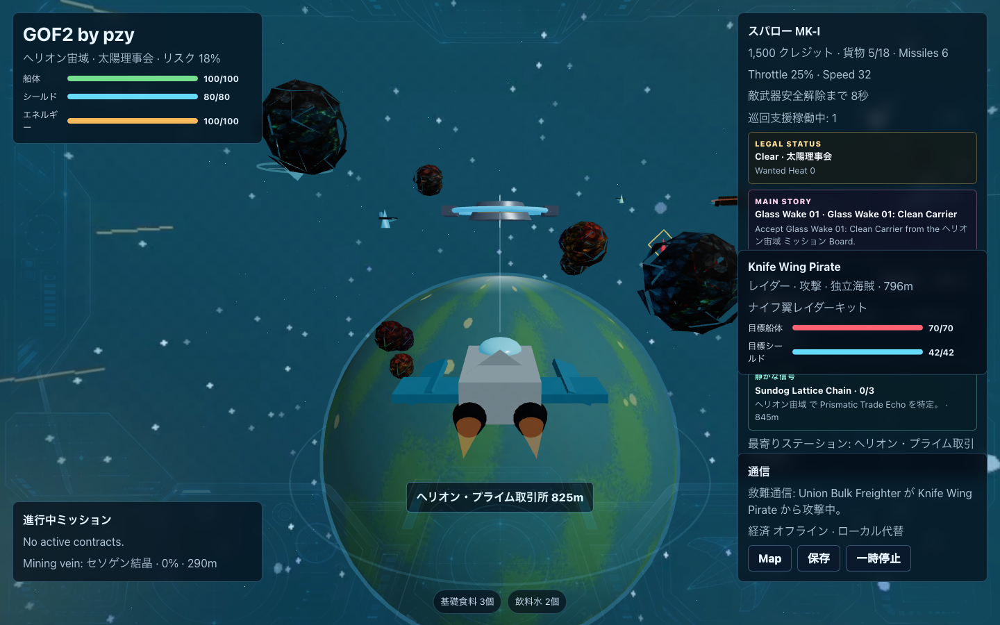
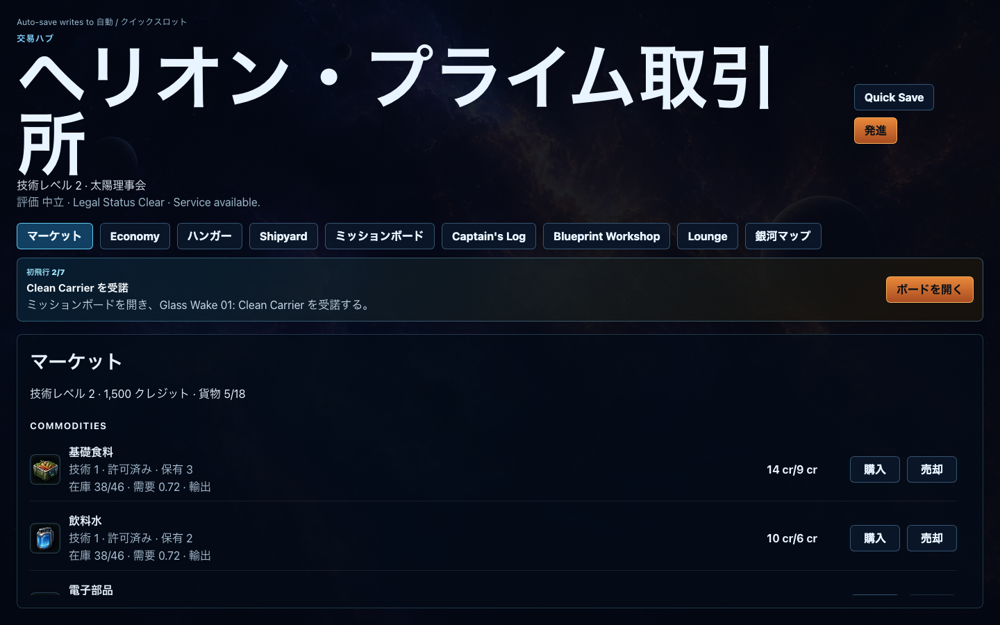
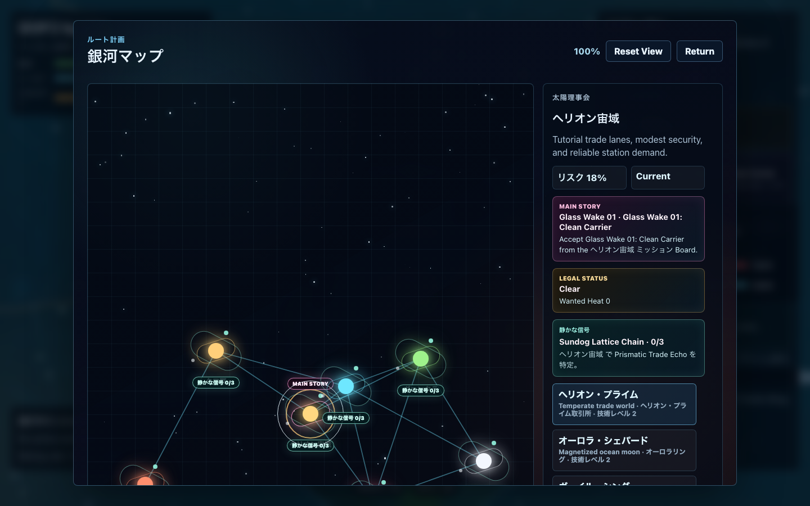
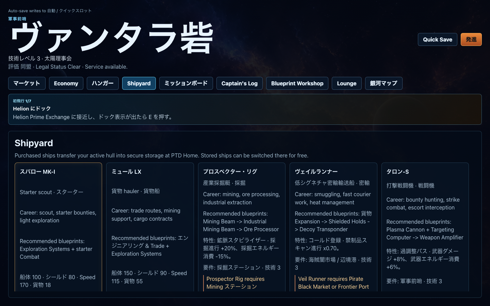

# GOF2 by pzy

[English](README.md) | [简体中文](README.zh-CN.md) | [繁體中文](README.zh-TW.md) | [日本語](README.ja.md) | [Français](README.fr.md)

ブラウザで遊べる、オリジナルの宇宙戦闘/交易ゲームの WebGL 縦切り版です。三人称視点の船を操縦し、海賊と戦い、小惑星を採掘し、貨物を回収し、ステーションにドックし、交易し、ミッションを受け、6つの辺境星系と専用拠点 PTD Home を探索し、ブラウザ保存で進行状況を管理できます。

## スクリーンショット

| ビュー | スクリーンショット |
| --- | --- |
| メインメニュー |  |
| フライト HUD |  |
| ステーション市場 |  |
| 銀河マップ |  |
| キャリア造船所 |  |

## 実行

```bash
npm install
npm run dev
npm run dev:full
npm run build
npm test
```

`npm run dev:full` は、ローカルの権威経済サーバー `127.0.0.1:19777` と Vite フロントエンドを同時に起動します。ブラウザ内 fallback 経済だけを使う場合は、通常の `npm run dev` を使ってください。

ワンコマンドの起動スクリプトも使えます。

```bash
./start.sh
```

## 操作

- W/S: スロットル上げ/下げ
- A/D: ロール
- マウス移動: フライト画面をクリック後、ピッチ/ヨーを操作
- 左クリック: パルスレーザー発射。小惑星の近くでは採掘
- 右クリックまたは Space: ホーミングミサイル発射
- Shift: アフターバーナー
- E: ドック、インタラクト、戦利品回収
- Tab: 海賊ターゲット切り替え
- M: 銀河マップ
- C: カメラ切り替え
- Esc: 一時停止

## アセット

オリジナルのラスターアセットは Codex 組み込みの `$imagegen` で生成し、WebP に変換して `public/assets/generated/` に配置しています。アプリは `public/assets/generated/manifest.json` から読み込みます。

生成済みプロジェクトアセット:

- `key-art.webp`
- `commodity-icons.webp`
- `equipment-icons.webp`
- `nebula-bg.webp`
- `skybox-panorama.webp`
- 星系ごとの `skybox-*.webp`
- 訪問可能な惑星ごとの `planet-*.webp`
- 5 種類の生成プレイヤー船シルエット用 `ships/*.glb`
- `asteroid-textures.webp`
- `faction-emblems.webp`
- `hud-overlay.webp`

著作権で保護された外部画像パックやモデルパックは含めていません。フライトシーンでは、星系ごとに生成したスカイボックスをカメラ固定の内側球背景として使い、`skybox-panorama.webp` と `nebula-bg.webp` を fallback として残しています。惑星は生成された正距円筒 WebP 表面テクスチャを大型 Three.js 球体に貼ることで、各ステーションが自分の可視惑星のそばに配置されます。プレイヤー船モデルは `scripts/generate-ship-models.mjs` で生成したローカル GLB ファイルで、実行時はアセット manifest から読み込み、欠落時は手続き的ジオメトリに fallback します。ステーション、小惑星、弾体、戦利品、fallback 船は Three.js プリミティブを使います。`public/assets/music/` の BGM は CC0 トラックで、出典とライセンス情報は `public/assets/music/credits.json` に記録されています。

## ジャンプ移動

銀河マップのジャンプ先は、星系全体ではなく発見済み惑星ステーションになりました。船はステーションを離れ、ローカルジャンプゲートへ飛び、ワームホール航行を開始し、選択したステーション付近に出現します。自動ドックはしません。既知星系は主惑星を最初から表示します。他の惑星はローカル飛行中に Unknown Beacon のスキャン対象として現れ、プレイヤーがスキャン範囲に入るとジャンプ先として解禁されます。ナビゲーション段階では手動操縦入力でオートパイロットを解除しますが、ゲートスプールまたはワームホールに入ると航行は完了します。

## 交易と契約

ステーション市場は保存済みの在庫、需要、基準回復を追跡します。購入するとローカル在庫が減り買値が上がります。売却すると在庫が増え需要が落ち着きます。ローカル REST + SSE 経済バックエンドは、NPC 採掘船、クーリエ、貨物船、商人、密輸船を全体シミュレーションし、市場イベントと可視 NPC 交通をゲームへストリーミングします。ステーションの Economy タブは Dispatch Board も兼ね、合法補給便や密輸便を受諾し、ルート設定し、HUD/マップで追跡し、完了時に市場圧力へ反映できます。

契約は保存済みの船内時間を使います。クーリエ、貨物、旅客、採掘、賞金、護衛、サルベージ、Dispatch の各ミッションには期限と評判への影響があります。旅客契約は貨物容量を予約し、貨物輸送は納品時にプレイヤー提供品を消費し、護衛ミッションは飛行中に船団をスポーンし、サルベージミッションは回収可能な箱をスポーンします。可視経済 NPC には Hail、Escort、Rob、Rescue、Report が可能で、ローカルサービスがオンラインなら強奪、救助、通報の結果がバックエンドへ記録されます。

メインストーリーは Glass Wake Protocol です。Mirr 探査機、偽装交易ビーコン、Ashen 中継海賊、Unknown Drones、Echo Lock 目標、Listener Scar をめぐる 13 章のミッションチェーンです。ステーションには Captain's Log タブがあり、章の進行、現在目標、再挑戦可能な失敗、解禁済みストーリーログを追跡します。追加のストーリー保存状態は不要です。

## 船と装備

装備は船のロードアウトとインベントリモデルを使います。主武装、副武装、ユーティリティ、防御、エンジニアリングの各モジュールは対応スロットを消費します。インストール時は装備インベントリから 1 個消費し、アンロード時はインベントリに戻ります。使用武器はインストール済みロードアウトの順序で決まります。Blueprint Workshop の製造はクレジットと貨物素材を消費し、完成品をインベントリへ追加します。自動装備はしません。キャリア装備ルートにより、採掘、密輸、戦闘、探索ビルドを伸ばせます。

艦隊には 5 種類の生成 GLB シルエットを共有する 9 種類のプレイ可能船体があります。starter、hauler、miner、smuggler、fighter、gunship、explorer のキャリアは、それぞれ異なる性能、スロット、特性、標準ロードアウト、購入条件を持ちます。新しい船を購入すると標準ロードアウトを装備し、古い船体と装備を専用の PTD Home ステーションに保管します。保管済み船は PTD Home にドックしている時だけ無料で切り替えられます。

## セーブ、データ、オーディオ

ブラウザ保存システムには 3 つの手動スロットと 1 つの自動/クイックスロットがあります。古い単一スロット v1 セーブは、v2 セーブインデックスを初めて読む時に自動スロットへ移行されます。スロットのメタデータには星系、ステーション/飛行状態、クレジット、ゲーム時間、保存日時、バージョンが表示されます。

ゲーム内容は、商品、船/装備、星系/ステーション、勢力、ミッションの強く型付けされたデータモジュールに分かれており、重複 ID や壊れた参照を検査する検証テストがあります。

オーディオはハイブリッド実行時です。SFX、警告音、fallback 音楽は Web Audio API で合成し、CC0 の BGM は現在星系、ステーション種別、戦闘状態でルーティングされます。アセット manifest はフライトテーマ、ステーションテーマ、戦闘音楽を `public/assets/music/` のファイルへ対応付けます。外部トラックが再生できない場合、手続き的音楽レイヤーが引き継ぎます。設定にはマスター、SFX、音楽、音声、ミュートがあります。

## 既知の制限

これは縦切り版であり、完全なキャンペーンではありません。権威経済バックエンドはローカル開発サービスです。オフラインの場合、ブラウザはローカル市場シミュレーションへ fallback するため、交易は引き続き遊べます。バックエンド依存の NPC/経済イベントは穏やかに機能低下します。商品、装備、勢力のスプライトシートは UI で CSS アトラス配置により切り出しています。手続き的 SFX と fallback 音楽は意図的に軽量で、手作業で入れた BGM の範囲は現在の CC0 トラックセットに限られます。
