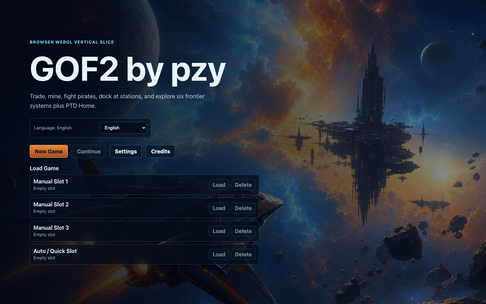
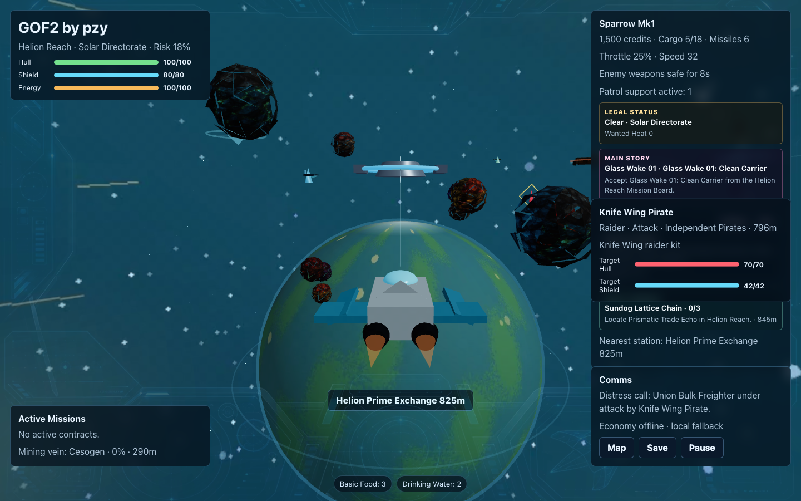
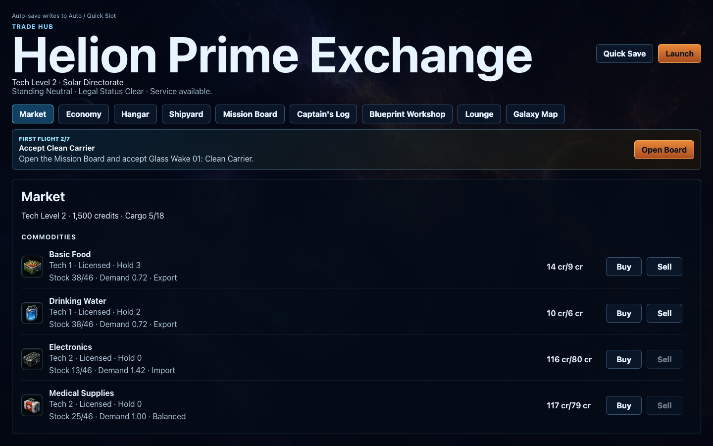
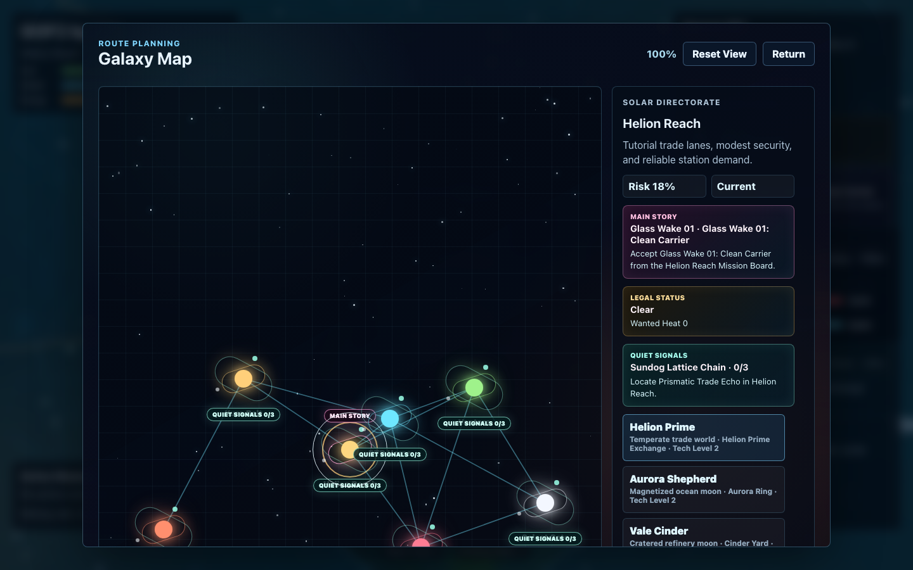
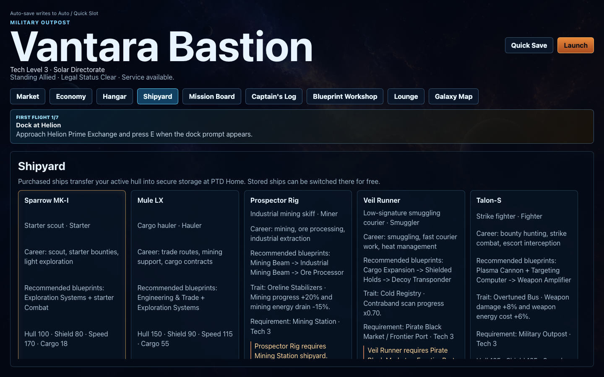

# GOF2 by pzy

[English](README.md) | [简体中文](README.zh-CN.md) | [繁體中文](README.zh-TW.md) | [日本語](README.ja.md) | [Français](README.fr.md)

一個可在瀏覽器中遊玩的 WebGL 太空戰鬥/貿易垂直切片。駕駛第三人稱飛船，迎戰海盜，開採小行星，回收貨物，停靠太空站，進行交易，接受任務，並探索六大前線星系 + PTD Home 專用據點，進度透過瀏覽器儲存/讀取。

## 截圖

| 視圖 | 截圖 |
| --- | --- |
| 主選單 |  |
| 飛行 HUD |  |
| 太空站市場 |  |
| 銀河地圖 |  |
| 職業船塢 |  |

## 執行

```bash
npm install
npm run dev
npm run dev:full
npm run build
npm test
```

`npm run dev:full` 會同時啟動本機權威經濟後端 `127.0.0.1:19777` 和 Vite 前端。只想使用瀏覽器內建經濟 fallback 時，可以執行普通的 `npm run dev`。

也可以直接執行一鍵腳本：

```bash
./start.sh
```

## 操作

- W/S：增加/降低推力
- A/D：橫滾
- 滑鼠移動：點擊飛行視圖後控制俯仰/偏航
- 滑鼠左鍵：發射脈衝雷射，靠近小行星時採礦
- 滑鼠右鍵或 Space：發射導引飛彈
- Shift：加力
- E：停靠、互動、收集戰利品
- Tab：切換海盜目標
- M：銀河地圖
- C：切換鏡頭
- Esc：暫停

## 資源

原始點陣資源由 Codex 內建 `$imagegen` 生成，轉換為 WebP 後放入 `public/assets/generated/`。應用透過 `public/assets/generated/manifest.json` 載入這些資源。

生成的專案資源包括：

- `key-art.webp`
- `commodity-icons.webp`
- `equipment-icons.webp`
- `nebula-bg.webp`
- `skybox-panorama.webp`
- 每個星系的 `skybox-*.webp`
- 每個可訪問行星的 `planet-*.webp`
- 五套生成玩家飛船輪廓的 `ships/*.glb`
- `asteroid-textures.webp`
- `faction-emblems.webp`
- `hud-overlay.webp`

倉庫不包含受版權保護的外部圖片或模型包。飛行場景使用每星系生成的天空盒作為鎖定相機的內球背景，並保留 `skybox-panorama.webp` 和 `nebula-bg.webp` 作為 fallback。行星使用生成的等距柱狀 WebP 紋理貼到大型 Three.js 球體上，讓每個太空站都靠近自己的可見星球。玩家飛船模型是本機生成的 GLB 檔案，由 `scripts/generate-ship-models.mjs` 生成；執行時透過資源 manifest 載入，缺失時回退到程式化幾何體。太空站、小行星、彈體、戰利品和 fallback 飛船使用 Three.js 基礎體。`public/assets/music/` 下的背景音樂為 CC0 曲目，來源和授權記錄在 `public/assets/music/credits.json`。

## 躍遷旅行

銀河地圖現在以已發現的行星太空站為躍遷目標，而不只是整個星系。飛船離開太空站後會飛向本地躍遷門，啟動蟲洞航行，並在目標太空站附近退出，而不是自動停靠。已知星系預設揭示主行星；其他行星會在本地飛行中顯示為 Unknown Beacon 掃描目標，玩家飛入掃描範圍後會解鎖為躍遷目的地。導航階段的手動飛行輸入會取消自動導航；一旦開始星門充能或蟲洞階段，航行會完成。

## 交易與任務

太空站市場會保存庫存、需求和基線恢復狀態。購買會降低本地庫存並推高買入價格；出售會增加庫存並降低需求。本機 REST + SSE 經濟後端會全局模擬 NPC 礦工、信使、貨船、商人和走私者，然後把市場事件和可見 NPC 航線串流同步回遊戲。太空站的 Economy 標籤頁同時也是 Dispatch Board：合法補給與走私調度可接取、設航線、在 HUD/星圖追蹤，並在完成後回寫市場壓力。

合約使用已保存的艦載時間。信使、貨運、客運、採礦、懸賞、護航、回收和調度任務都有截止時間和聲望後果。客運合約會預留貨艙容量，貨運任務交付時會消耗玩家提供的貨物，護航任務會在飛行中生成護航船隊，回收任務會生成可回收箱。可見經濟 NPC 可 Hail、Escort、Rob、Rescue 或 Report；本機服務在線時，劫掠、救援和上報會寫入後端後果。

主線劇情是 Glass Wake Protocol，一條 13 章任務鏈，圍繞 Mirr 探針、偽造貿易信標、Ashen 中繼海盜、Unknown Drones、Echo Lock 目標和 Listener Scar 展開。太空站包含 Captain's Log 標籤頁，用於追蹤章節進度、目前目標、可重試失敗和已解鎖劇情日誌，不需要新增獨立劇情存檔狀態。

## 飛船和裝備

裝備系統使用飛船裝載 + 庫存模型。主武器、副武器、功能、防禦和工程模組會占用對應槽位；安裝會從裝備庫存消耗一個物品，卸載會返回庫存，目前武器由已安裝裝載順序決定。Blueprint Workshop 的製造會消耗信用點和貨物材料，並把成品加入庫存，而不是自動安裝。職業裝備路線支援採礦、走私、戰鬥和探索構築。

艦隊包含 9 個可玩船體，復用 5 套生成 GLB 外形輪廓；starter、hauler、miner、smuggler、fighter、gunship 和 explorer 職業現在擁有不同屬性、槽位、特性、預設裝載和購買門檻。購買新船會裝備其預設裝載，並把舊船體和已安裝裝備存放到專用的 PTD Home 太空站。已存放飛船只能在 PTD Home 免費切換。

## 存檔、資料和音訊

瀏覽器存檔系統提供三個手動槽位和一個自動/快速槽位。舊的單槽 v1 存檔會在首次讀取 v2 存檔索引時遷移到自動槽。槽位元資料顯示星系、太空站/飛行狀態、信用點、遊戲時間、保存日期和版本。

遊戲內容拆分為強型別資料模組，涵蓋商品、飛船/裝備、星系/太空站、派系和任務，並透過校驗測試檢查重複 ID 和斷裂引用。

音訊採用混合執行時：SFX、警告音和 fallback 音樂由 Web Audio API 合成，CC0 背景曲按目前星系、太空站類型和戰鬥狀態路由。資源 manifest 把飛行主題、太空站主題和戰鬥音樂映射到 `public/assets/music/` 檔案；外部曲目無法播放時，程式化音樂層會接管。設定包含主音量、SFX、音樂、語音和靜音控制。

## 已知限制

這是一個垂直切片，不是完整戰役。權威經濟後端是本機開發服務；如果它離線，瀏覽器會回退到本地市場模擬，保證交易仍可遊玩，依賴後端的 NPC/經濟事件會平滑降級。商品、裝備和派系精靈圖在 UI 中透過 CSS 圖集定位裁切。程式化 SFX 和 fallback 音樂刻意保持輕量，而人工整理的 BGM 覆蓋範圍仍限於目前 CC0 曲目集。
